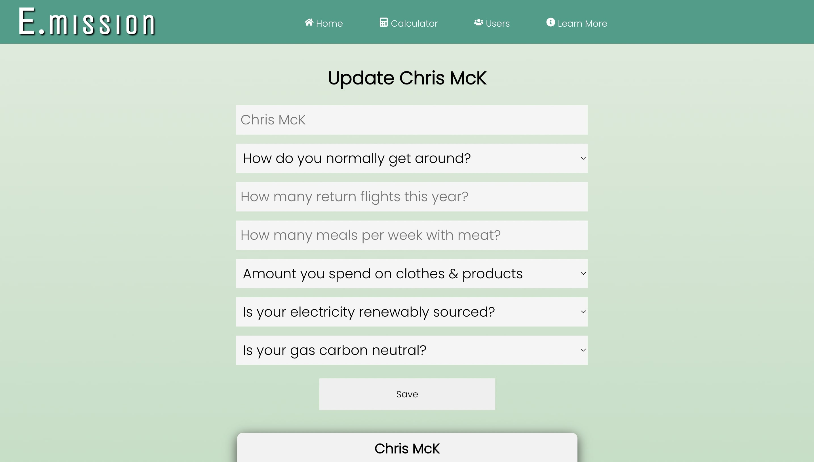
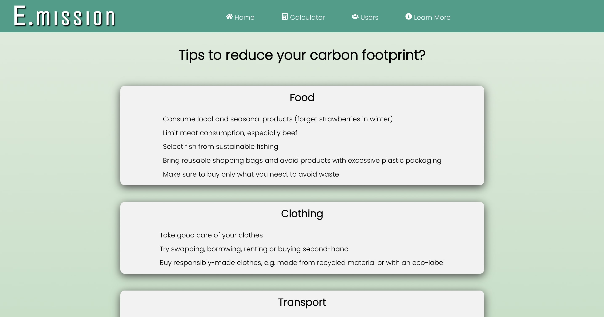

# carbon-calculator
E.mission Web App - Full-stack Javascript web application, using the React library, that allows a user to calculate their yearly carbon emissions and compare it against other users, world and UK averages. Takes user inputs and runs backend calculations to create carbon totals, stores data in MongoDB and uses the Highcharts charting library to display results in a visually appealing way. 

## Landing Page and User Journey

<table>
  <tr>
    <td>Homepage</td>
     <td>Questionnaire</td>
  </tr>
  <tr>
    <td></td>
    <td></td>
    </tr>
 </table>
 <table>
  <tr>
    <td>Questionnaire II</td>
     <td>User Results</td>
  </tr>
  <tr>
    <td></td>
    <td></td>
    </tr>
 </table>
 <table>
  <tr>
    <td>User Compare</td>
  </tr>
  <tr>
    <td></td>
   </tr>
 </table>
 <table>
  <tr>
    <td>Update User</td>
     <td>Learn More</td>
  </tr>
  <tr>
    td></td>
    <td></td>
    </tr>
 </table>
 

